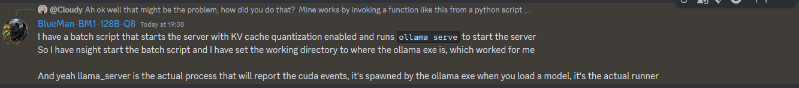

# Plan

Things to Try:
- Get ollama working
- Run basic simulation
- Use a third agent to determine winner
- Figure out how to parallelize simulations
- Run monte carlo sims 
- Generate stats and make graphs
- Figure out how to use the GPU for performance boosts
- TTS
- Stop conditions, whatever they are
- Try smaller models
- Look into llm observability
- Look into llm ops
- Look into drilldowns
- Get AutoGen working

## Get Ollama Working

First step is downloading, bosh
We need to pick out a model I think
    It seems to have downloaded llama3.2 by default
You can test ollama with the terminal using `ollama run llama3.2` 
Then lets try creating a basic py script that calls it with a string and gets a response 
Then lets make some classes to encapsulate stuff

There's a feature you can do where you can make new models that have custom init prompts like "Speak only in <language>" 

### Ollama With Python

First step is to `pip install ollama` 
Then you `import ollama` 
`response = ollama.generate(model, prompt);` 

## Run basic simulation

This was very easy to set up. Still too slow though

## Run 3 agent simulation

Also pretty easy to write. Very cute responses

## Parallelizing the Simulations

Made a new test for running multiple generations in parallel 
Seeing massive gains. Generally it's about 130% faster than running them serially 
Wondering if something is off though, maybe the gains aren't coming from them actually running in parallel but instead somewhere else
Soon I should work on parallelizing any type of test 

## Monte Carlo

I did this step on my desktop otherwise it would have taken a million years
I was able to run a very large amount of agent_x3_sim_test calls in parallel and have the judge write a one-word output to a file
Then I can easily graph the data in the form of a bar chart which you can see in the data folder

## GPU Profling & Optimizations

I want to try and profile the program using GPU profiling apps
I'm familiar with NVIDIA NSight Graphics but I might see if I can use NSight Compute to profile AI programs like Ollama

Here's how to profile using NSight Compute on the CLI:
`ncu --set full --target-processes all python main.py test` 
Make sure Ollama is using the GPU with `ollama ps` 
Read the ollama logs in ~/AppData/Local/Ollama to get useful info. `CUDA_VISIBLE_DEVICES` should be set to 0

Make sure you install the cuda toolkit that matches your cuda version (Seen with `nvidia-smi`)
I also made a new "info" test which should be useful if you want to try the same thing. Ask me for help if I get it working

Tried using NSight Systems instead to see any difference and it does detect something from ollama but still isn't attaching to the CUDA stuff
Taking a break, will come back to this with a fresh mind. Need to do some research when I do 

### Debugging why ncu won't attach to ollama

`ollama ps` shows 100% GPU usage
app.log shows ollama detects `CUDA_VISIBLE_DEVICES=0` 
`nvidia-smi` shows CUDA 12.6 is installed
I also installed the 12.6 CUDA toolkit 

### Debugging session 2

Ok this is just not working, and it's very hard to find people knowledgable about both GPU profiling and local LLMs online
NSS is detecting ollama but not CUDA
I made NSS profile a sample cuda program and it worked properly 
NCU won't attach to ollama at all, detects nothing 
As I've noticed before, `server.log` mentions "CUDA0" quite a lot
I tried making NCU attach directly to a running instance of ollama.exe but I haven't got it working yet
    I was thinking maybe the py script isn't the one managing the GPU commands but instead ollama.exe or ollama app.exe
Note that I did try launching ollama.exe through NCU and it still didn't work so...
I need to have a look at the llama.cpp code and see if I can find any clues
What I really need though is someone to give some guidance, maybe there's a forum or something somewhere 
Could be good if I can find some other way to check if ollama is running CUDA, then I can determine whether the problem is ollama or NCU 
Although once I get assigned some actual tasks I might just drop this, maybe not worth the effort / I'm not quite experienced enough yet 

Come back to this:

## LLM Observability

This is complete visibility into every layer of an LLM software system (App, prompt and response)

LLM Monitoring involves tracking LLM apps performance through evaluation metrics and methods. LLM Observability makes monitoring possible by providing visibility and tracing 

## Notes

I see CUDA mentioned while Ollama is downloading

Profiling a basic response from ollama on my laptop takes 38,000ms which is obviously beyond abhorrent so I need to find a way to speed this up multiple orders of magnitude if I can. Or at least utilize the downtime somehow
    Obviously part of this is how weak my GPU is on my laptop so I'll be interested to see the speed up on my desktop

## TODO

- Fix load duration profiling not making any sense